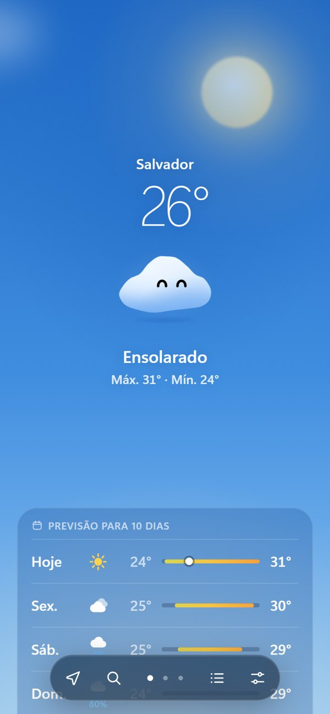
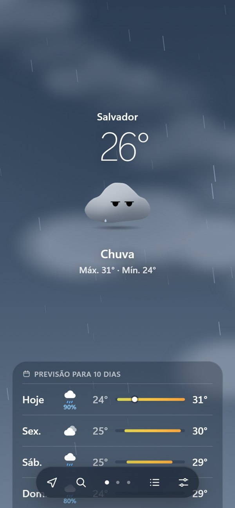
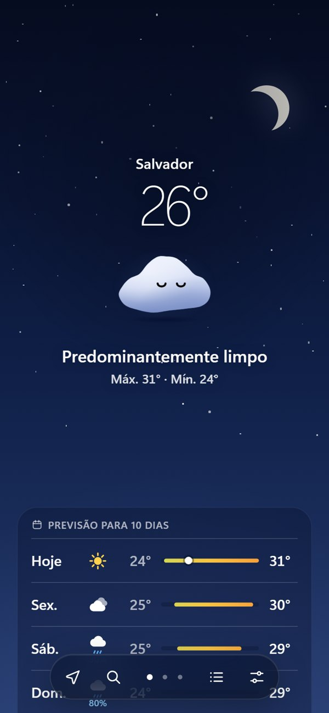

# Climinha

**O clima com personalidade.** Um app de previsão do tempo em que o céu é o ambiente e uma pequena nuvem, o Climinha, sente o clima junto com você.

<p align="center">
  
  
  
</p>

<p align="center"><sub>Sol: feliz · Chuva: cinza e chateado · Noite: dormindo</sub></p>

---

## A ideia

A interface segue a disciplina visual das interfaces da Apple (hierarquia tipográfica, conteúdo de ponta a ponta, vidro só onde há interação, movimento sutil), mas a identidade é do Climinha:

- **O céu é o clima.** Gradiente, sol, lua, estrelas, três camadas de nuvens, névoa, chuva e relâmpagos mudam conforme o tempo real da cidade.
- **O Climinha sente o clima.** A cor do corpo e a expressão mudam com o tempo, e ele reage ao que acontece na tela.
- **Informação limpa.** Na primeira tela ficam só a cidade, a temperatura, a condição e a previsão de 10 dias. O resto aparece conforme você rola.

## O Climinha

| Clima | Corpo | Humor |
|---|---|---|
| Sol / céu limpo | branco a azul vivo | feliz |
| Nublado | cinza | chateado |
| Neblina | cinza-azulado claro | normal |
| Chuva | cinza médio a grafite | chateado, com gotas saindo do corpo |
| Tempestade | quase preto, com brilho amarelo por dentro e raios saindo do corpo | com medo (e se assusta com os relâmpagos) |
| Noite | branco frio | dormindo |

A temperatura também mexe com ele:

| Temperatura | Como ele fica |
|---|---|
| acima de 34° | avermelhado, cansado de calor, suando |
| abaixo de 16° | azulado, tremendo de vez em quando |
| abaixo de 5° | gelado, encolhido, tremendo sem parar |

Comportamentos:

- **Intro:** ele passa bem perto da tela, como uma nuvem atravessando o céu, dá uma piscadinha de um olho só e encolhe até o lugar dele.
- **Percebe o clima:** chega neutro, olha para o céu e só então reage — fica cinza no nublado, chateado na chuva, com frio no inverno. Ao trocar de cidade, olha de novo.
- **Corpo fluido:** o contorno ondula o tempo todo e balança com inércia quando ele se move.
- **Acompanha a interface:** ao rolar, ele se solta do topo e pousa em cima da barra de navegação, centralizado. A velocidade do scroll inclina e estica o corpo. Ao arrastar entre cidades ele continua no centro e balança com a inércia do gesto.
- **Sono:** à noite, um toque o acorda. Depois de 10 s sem interação ele fica com sono e as pálpebras descem devagar. Aos 20 s volta a dormir.

## Funcionalidades

- Previsão de 10 dias com barras de faixa de temperatura
- Previsão por hora, com nascer e pôr do sol na linha do tempo
- Chuva nas próximas 3 horas (aparece só quando há chuva prevista)
- Detalhes: índice UV, sensação térmica, vento com bússola, umidade, precipitação, nascer e pôr do sol
- Várias cidades: troque arrastando a tela (dedo, mouse ou trackpad), pelos pontos da barra ou pelas setas do teclado
- Busca de cidades, localização atual, °C / °F
- Respeita "reduzir movimento" do sistema
- Tempo real: atualiza sozinho com o app aberto, e dia/noite, "Agora" e "Hoje" seguem o relógio da cidade
- Funciona offline com o último dado salvo

## Stack

- [React 19](https://react.dev) + [TypeScript](https://www.typescriptlang.org) + [Vite](https://vite.dev)
- [Motion](https://motion.dev) para animações, molas e movimento ligado ao scroll
- [Open-Meteo](https://open-meteo.com) para previsão e busca de cidades (sem chave de API)
- Chuva desenhada em canvas dentro de um Web Worker (`OffscreenCanvas`), fora da thread principal

## Rodando localmente

```bash
npm install
npm run dev
```

Outros comandos:

```bash
npm run build     # build de produção em dist/
npm run preview   # serve o build localmente
npm run lint      # oxlint
npm run typecheck # verificação de tipos
```

## Deploy

O projeto é um site estático. Na [Vercel](https://vercel.com), importe o repositório; o preset **Vite** é detectado automaticamente (build `npm run build`, saída `dist`). Não há variáveis de ambiente.

## Estrutura

```
src/
├── climinha/       personagem: SVG, corpo fluido, humores e cores por clima
├── environment/    céu em camadas: nuvens, sol, lua, estrelas, névoa, chuva, relâmpago
├── components/     hero, cards, intro, barra de navegação, lista de cidades
├── theme/          tokens de design, temas por clima, tokens de movimento
├── weather/        cliente Open-Meteo, localização, cache, relógio da cidade, formatação
└── icons/          ícones de clima e de interface próprios
```

## Créditos

- Dados meteorológicos e busca de cidades: [Open-Meteo](https://open-meteo.com) (CC BY 4.0)
- Nome da cidade a partir da localização: [BigDataCloud](https://www.bigdatacloud.com) e [Nominatim](https://nominatim.org) · © colaboradores do [OpenStreetMap](https://www.openstreetmap.org/copyright) (ODbL)
- Fonte [Fredoka](https://fonts.google.com/specimen/Fredoka) (SIL Open Font License)

## Licença

Código sob a licença [MIT](LICENSE).

O nome **Climinha** e o personagem são a identidade deste projeto e não fazem parte da licença: se for reaproveitar o código, use outro nome e outro personagem.
